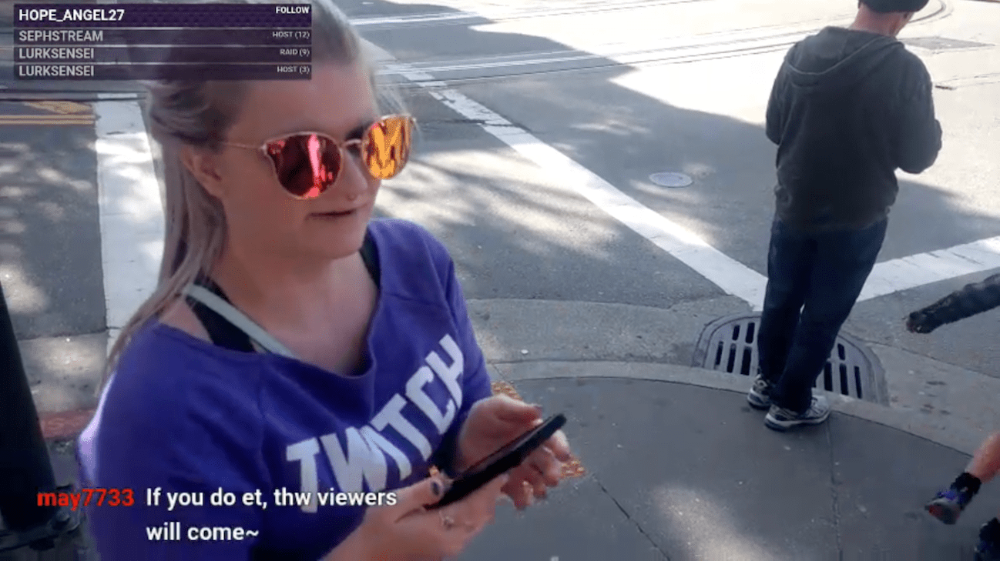

[//]: # 'Image of project fi usage data'

My fianc&#233;e, [PrancingPwnies](https://www.twitch.tv/prancingpwnies/), is a streamer on Twitch. She entertains and plays the games while I handle most of the tech and behind the scenes stuff.

The biggest thing that has helped her channel grow has been a **consistent schedule**. Lately, we've been doing a lot of traveling. We wanted to figure out how she could keep up that consistency by streaming while on the road.

This post will cover our process to get a decent road trip stream set up. I'll also go over everything we've learned, and most importantly, **the cost of everything**. (TL;DR at bottom).

---

<!-- TOC -->

- [Overview](#overview)
  - [Same PrancingPwnies Experience](#same-prancingpwnies-experience)

<!-- /TOC -->

---

# Overview

We had some important things to cover before we were ready for the first stream.

- Same PrancingPwnies Experience
- Stream Quality & Uptime
- Cost

## Same PrancingPwnies Experience

Viewers should have the exact same PrancingPwnies experience as if the stream was at home. Streamlabs makes a decent mobile app that allows you to stream from your phone. It comes with alerts, etc. While it is a great starter app, it really fails in comparison to the full power of OBS on a computer. You can't read chat unless you're constantly looking at the phone.

[//]: # 'Image of streamlabs beach stream setup'

To be continued...
