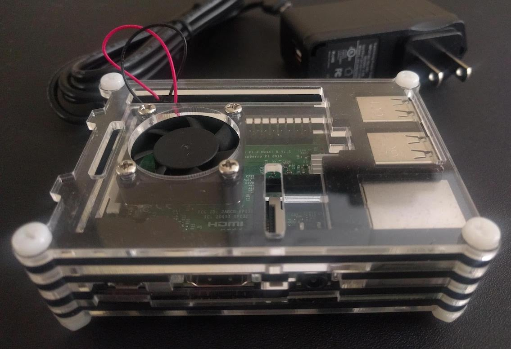
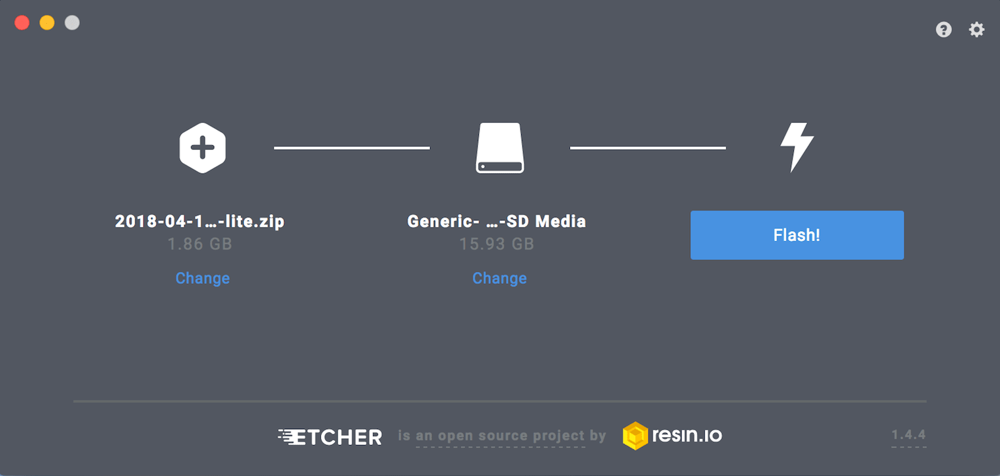
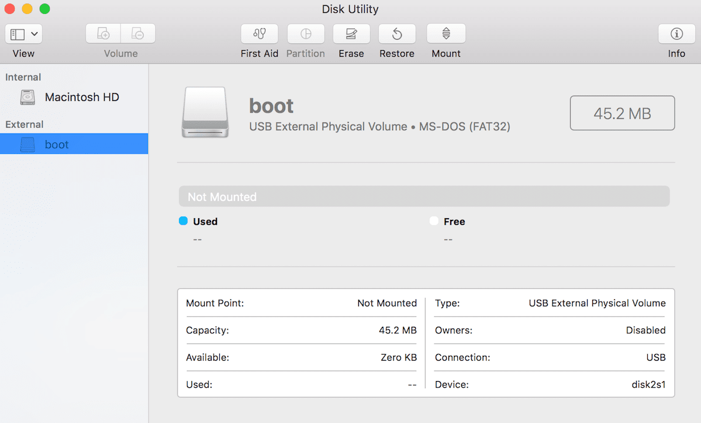
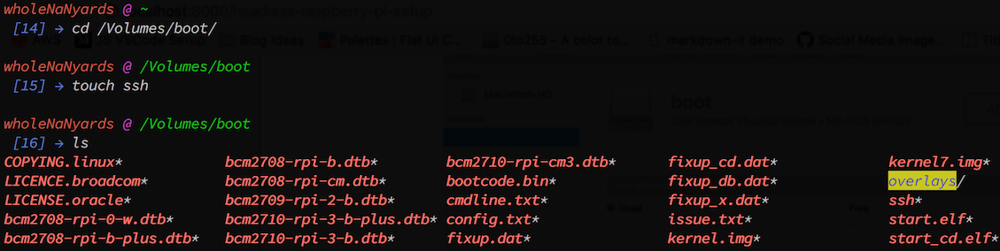
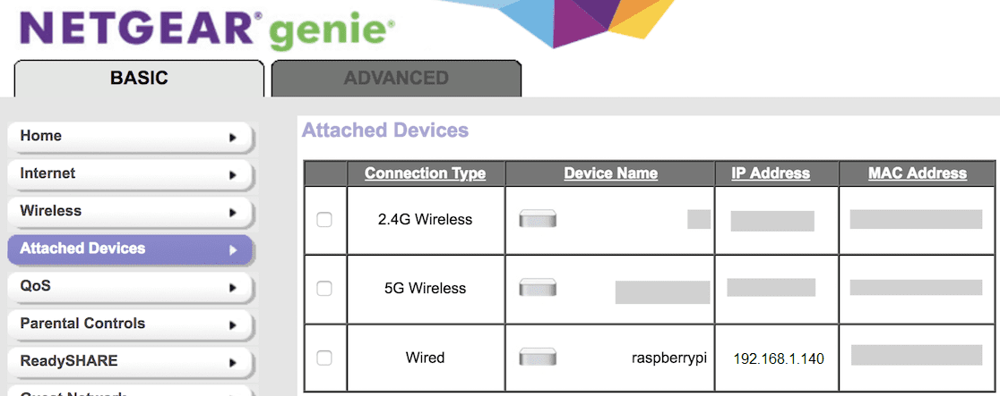
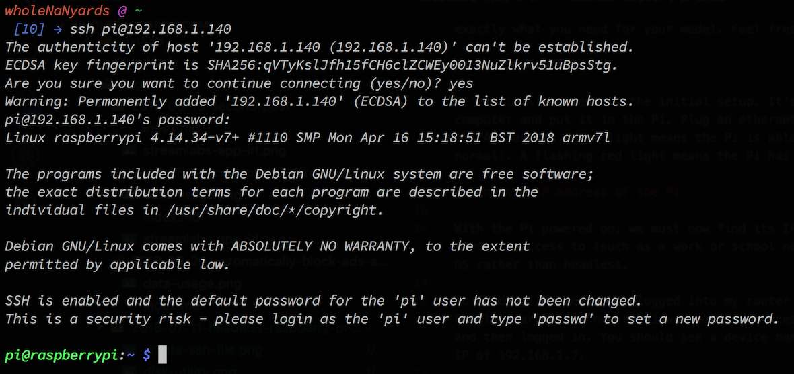
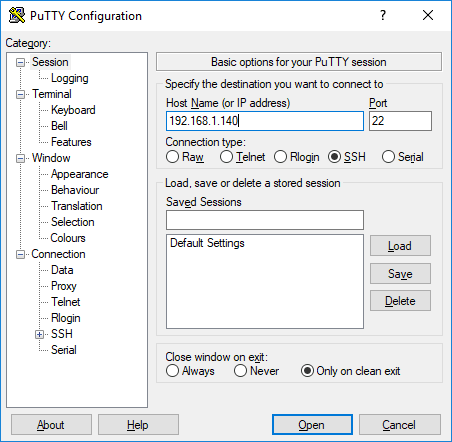
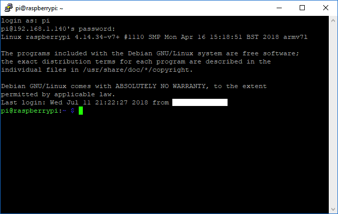
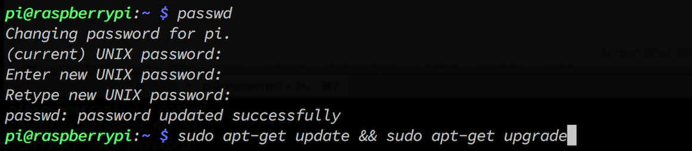

[//]: # 'Raspberry Pi'

The Raspberry Pi is an inexpensive yet powerful mini computer. Among its countless uses, it can be used to automate your home, run a server, or even make a video game system. This post will cover how to set up a Raspberry Pi using SSH, without the need for peripherals such as a USB mouse or keyboard.

---

<!-- TOC -->

- [Getting Started](#getting-started)
  - [Side Note - Cases](#side-note---cases)
- [Software Setup](#software-setup)
  - [Flash the SD Card](#flash-the-sd-card)
  - [Side Note - Mounting the SD Card](#side-note---mounting-the-sd-card)
  - [Enable SSH on the Pi](#enable-ssh-on-the-pi)
  - [Side Note - Enabling WiFi](#side-note---enabling-wifi)
- [Plug in the Pi](#plug-in-the-pi)
- [Connecting to the Pi](#connecting-to-the-pi)
  - [Find the IP Address of the Pi](#find-the-ip-address-of-the-pi)
  - [SSH into the Pi (Mac/Linux)](#ssh-into-the-pi-maclinux)
  - [SSH into the Pi (Windows)](#ssh-into-the-pi-windows)
- [Change Password and Update](#change-password-and-update)

<!-- /TOC -->

---

# Getting Started

To begin, we will need the following items:

- **Raspberry Pi** (Model 3B is what I'm using here although I've recently done this setup with a Model 1B+ so any should work)
- **Micro SD Card** (8GB or more, older models need regular SD cards)
- **SD Card Writer**
- **Power Supply** [(5V 2.5A)](https://www.raspberrypi.org/documentation/hardware/raspberrypi/power/README.md)
- **Ethernet Cable** (Optional, some models have built in WiFi)
- **Laptop or PC** (For SSH)
- **Access to Your Router** (To find the IP address of the Pi)

## Side Note - Cases

Raspberry Pi's can be a pain to transport, and they can get really hot if you are doing heavy computing. I use a case with a built-in fan for all of my Raspberry Pis. [This bundle](https://www.amazon.com/dp/B07CB7P1RD) comes with a case, a fan, 3 heat sinks, and a power supply. I recommend it, but it may be overkill depending on your use. **Note:** The linked case is for the Model 3B+ so make sure you're grabbing a case for the correct model.



# Software Setup

Since this will be a fresh setup, let's start by downloading the Operating System. We will be using the OS Raspbian Stretch Lite. It can be downloaded [here](https://www.raspberrypi.org/downloads/raspbian/). Both the torrent and the zip are fine, I used the torrent because it was much faster. There is no need to unzip the file once the download has finished.

## Flash the SD Card

To write the OS onto our SD card, we will be using a program called Etcher. It works on Mac, Windows, and Linux and is officially recommended by the Raspberry Pi team. Download Etcher [here](https://etcher.io/) and install it onto your system.

Insert the SD card into your computer and open up Etcher. Click "Select Image" and select the OS zip file we just downloaded. Next, click on "Select Drive" and select your SD card (It may already be selected). Click on "Flash" to write the OS to the SD card.



## Side Note - Mounting the SD Card

Initially, my SD card was not found when I clicked on "Select Drive". To fix this on Mac, open up Disk Utility by pressing `cmd + space` and then typing "Disk Utility". Select your SD card from the list on the side, and then click "Mount" on the top bar. If your SD card is not listed, you may have a broken card or card reader. Troubleshooting this issue is out of the scope of this post.



## Enable SSH on the Pi

Due to some issues in the past, [SSH is disabled](https://www.raspberrypi.org/blog/a-security-update-for-raspbian-pixel) by default on the Pi. People weren't changing the default login information and their Pis were being exposed and used for malicious activities. We need to enable SSH on the Pi. It's very simple, all we have to do is add a file named "ssh" in the root of the SD card. (No extension, and it doesn't need any content in it).

With your SD card still connected and mounted to your computer, go to the root directory. For mine, it was located at /Volumes/boot. Open your terminal and execute the following commands:

```bash
cd /Volumes/boot
```

```
touch ssh
```

```bash
ls
```

You should now see a file named "ssh" on your SD card.



## Side Note - Enabling WiFi

If at all possible, I prefer to hard wire my Raspberry Pis. If you want to enable WiFi on the Pi, (assuming it has it built in), it's basically the same process we just did with SSH. We create a file named "wpa_supplicant.conf" in the root directory. But, this time we actually need to put [some information](https://raspberrypi.stackexchange.com/questions/10251/prepare-sd-card-for-wifi-on-headless-pi) in the file. Note that different models of the Pi may require different content in the file. A quick Google search should help you find exactly what you need for your model. Feel free to contact me if you are having any issues setting up WiFi.

# Plug in the Pi

We're finally done with the initial setup. It's time to connect and turn on the Pi. Eject the SD card from your computer and put it in the Pi. Plug an ethernet cable and a power source to the Pi. The Pi should now start booting up. A flashing green light means the Pi is able to read the SD card (this light will eventually go away, this is normal). A flashing red light means the Pi has powered (this is also normal).

# Connecting to the Pi

The hardware side of things should now be complete. If all went well, you should never have to touch your Raspberry Pi again. Let's now connect to the Pi using SSH.

## Find the IP Address of the Pi

With the Pi powered on, we must now find its IP address. **Note:** If you are on a shared network and don't have access to the router (such as a work or school network), this won't work and you may need to set up the Pi with the GUI OS rather than headless.

To find the Pi's IP address, I logged into my router and clicked on "Attached Devices". Each router is different, so do a Google search for "how to view attached devices for (your router)". For mine, I went to 192.168.1.1 in a web browser and then logged in. You should see a device named "raspberrypi". Take note of its IP address. In my case, mine had an IP of 192.168.1.140.



## SSH into the Pi (Mac/Linux)

Open your terminal and execute the command `ssh pi@IPADDRESS` where IPADDRESS is the IP address we just noted. For me, I typed:

```bash
ssh pi@192.168.1.140
```

Enter "yes" continue connecting to the device. It will then ask you for the password. Enter "raspberry" as the password and you should now be in.



## SSH into the Pi (Windows)

Windows does not come with a native SSH client, so we need get one. Download and install [PuTTY](https://www.putty.org/). Once installed, open PuTTY and enter in the IP address in the Host Name field. Make sure the port is set to 22. Click "Open" to SSH into the Pi.



Press "Yes" on the popup box to continue connecting. When prompted, login as "pi". Enter "raspberry" as the password and you should now be in.



# Change Password and Update

Let's change the default password. Enter the following command:

```bash
passwd
```

Enter the existing password (raspberry), then enter your new password twice. Congratulations, you're now protected from being a part of a botnet! Let's update the PI while we're at it. Enter the following command:

```bash
sudo apt-get update && sudo apt-get upgrade
```

When prompted, enter `y` to allow the updates.



Once the updates have completed, enter `exit` to terminate the SSH session (if you want).

Congratulations! You've successfully set up a headless Raspberry Pi over SSH. Now go out and build something cool!
