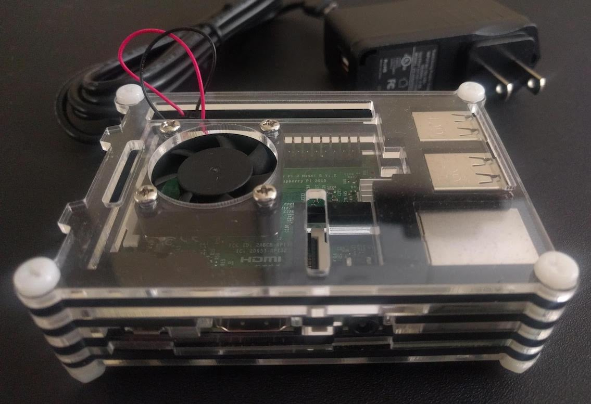

[//]: # 'Raspberry Pi'

The Raspberry Pi is a great device. It's affordable, powerful, and easy to use. This post will cover how to set up a Raspberry Pi using SSH, without the need for peripherals such as a USB mouse or keyboard.

To begin, we will need the following items:

- **Raspberry Pi** (Model 3B is what I'm using here although I've recently done this setup with a Model 1B+ so any should work)
- **Micro SD Card** (8GB or more, older models need regular SD cards)
- **Power Supply** [(5V 2.5A)](https://www.raspberrypi.org/documentation/hardware/raspberrypi/power/README.md)
- **Ethernet Cable** (Optional, some models have built in WiFi)
- **Laptop or PC** (For SSH)

# Side Note About Cases

Raspberry Pi's can be a pain to transport, and they can get really hot if you are doing heavy computing. I use a case with a built-in fan for all of my Raspberry Pis. [This bundle](https://www.amazon.com/dp/B07CB7P1RD) comes with a case, a fan, 3 heat sinks, and a power supply. I recommend it, but it may be overkill depending on your use.

# Download the OS

Since this will be a fresh setup, let's start by downloading the Operating System. We will be using the OS Raspbian Stretch Lite. It can be downloaded [here](https://www.raspberrypi.org/downloads/raspbian/). Both the torrent and the zip are fine, I used the torrent because it was much faster. There is no need to unzip the file once the download has finished.

# Flash the SD Card

To write the OS onto our SD card, we will be using a program called Etcher. It works on Mac, Windows, and Linux and is officially recommended by Raspberry Pi. Download Etcher [here](https://etcher.io/) and install it onto your system.

Insert the SD card into your computer and open up Etcher.
