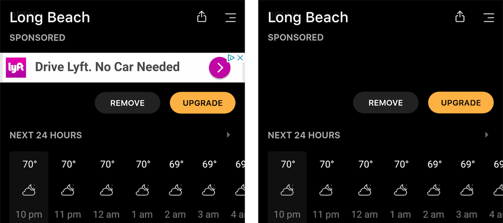

[//]: # 'Image of project fi usage data'

We all hate ads. They are the dirty price we pay to enjoy our favorite free sites. This is why we use an Ad Blocker. Maybe uBlock? It's easy enough to put an ad blocker on my PC, I've been doing it for years. But what about my fianc&#233;e's PC? Or our laptops? And our phones, tablets, xbox, and any other random device we seem to keep acquiring? We're going to accomplish this by using a program called Pi-hole.

# Why Block Ads on Your Home Network?

The reason for blocking ads should be fairly obvious, but I'm going to cover some reasons that you may not have thought of:

- **Faster Load Times**
- **Possibility to Save Money on Internet Usage**
- **Better Experience on All Devices**

## Faster Load Times

Ok, duh! Having no ads means our pages will load faster. But just how much faster can we get?

If you're like me, you know the pain of having too many tabs opened in Chrome. A page that loads ads is a page that takes from my precious Chrome resources. How much time and how many resources are we really wasting on ads? Let's take a look at an example on [forbes.com](https://www.forbes.com/sites/forbespr/2018/07/18/forbes-releases-2018-list-of-the-worlds-most-valuable-sports-teams).

Forbes Article Without Ads Being Blocked:

<video width="688" height="372">
  <source src="forbes-slow-good.mp4" type="video/mp4">
  Video of forbes page load time.
</video>

Let's analyze the above page load:

- At time **t = 0.388 sec**, content is ready to read
- At time **t = 1.639 sec**, a video ad had started to load
- At time **t = 6.291 sec**, an ad has loaded on the side bar
- At time **t = 14.222 sec**, an ad has loaded on the top bar

After **0.338 sec**, we are ready to read the content. Becuase of the ads, our browser is still using resources **14 seconds** after we're ready to start reading! Forbes is actually a pretty well-made site when it comes to browser performance. Imagine how many resources are being wasted by some of the other (slower) sites we use. Oh and by the way, this is over WiFi. It's much, much worse when using mobile data on our cell phones.

The Same Forbes Article with Ads Being Blocked:

<video width="708" height="362">
  <source src="pi-hole-no-ublock.mp4" type="video/mp4">
  Video of forbes page load time.
</video>

Let’s analyze the above page load:

- At time **t = 0.388 sec**, content is ready to read

Not bad! Now, let's take a look at some other reasons why we want an ad blocker for our home network.

## Possibility to Save Money on Internet Usage

The main image of this post if of my Pi-hole dashboard that shows that in a 24 hour period, my home network had **10,678** queries. This means that **41%** of all queries were recognized as ads and thus blocked.

My ISP has a 1TB data cap limit per month, and if I go over, I have to pay extra to use my internet.

## Better Experience on All Devices

There's gotta be a better solution than to install 10 different ad blockers. And there is, it's called Pi-Hole, and it's amazing. This post will cover everything you need to know about how to automatically block ads on all of your devices at home.

# Side Note - Not All Ads will Be Blocked

While Pi-hole is a great piece of software, it does not have a 100% block rate. This means that you may still see some ads, but at a drastically lowered amount. On your PC, uBlock chrome extension does other great things such as reformatting content (when there's empty space because of no ads), as well as preventing pop-up windows coming up.

Among other things, UBlock can do the following:

- **Block Ads**
- **Reformat Web Pages** (to look nicer when the ads are removed)
- **Prevent popups** (from showing up)

Pi-hole will prevent the ad, but it won't prevent the popup, so you'll get a blank page popup.

# How Does This Work?

The Pi-hole server receives all requests made on my home network. Most of the time, it lets them pass through and go out into the internet. However, if it recognizes that this request is for an ad, Pi-hole will kill the request and not send it out to the internet. This means I am physically not sending out requests to the internet.

# Technical Details

The following sections contain technical information about how and why all of this works. Feel free to skip this if you just want to set up your Pi-Hole.

- What We Need
  How Ads Work on the Web

## What We Need

Instead of having each device block ads, we need a way to block them at a higher level in the network chain. Specifically, we can use a custom DNS to block all requests that ads.

## How Ads Work on the Web

1.  We go to a web page, which downloads an HTML file
2.  That file contains ads
3.  Our browser makes additional requests for the ads
4.  Once those requests are finished, the browser displays them in the page

Image of Chrome dev tools network tab of ads requests.

Doing all of this will increase page load times.

# Set Up

1.  Set Up Raspberry Pi
2.  Set Up Pi-Hole
3.  Test

To be continuued...

In a future post I will be exploring the feasability of blocking all ads when outside the home on a mobile network. See you then!
