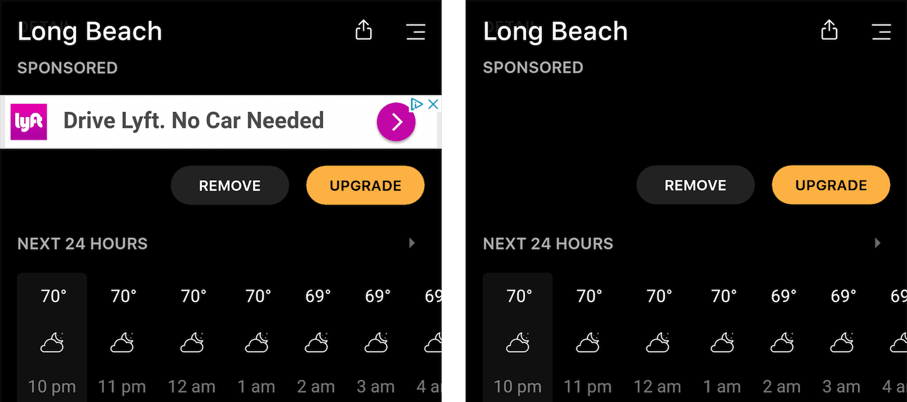

[//]: # 'Image of Pi-hole Dashboard'

We all hate ads. They are the dirty price we pay to enjoy our favorite free sites. This is why we use an Ad Blocker. Maybe uBlock? It's easy enough to put an ad blocker on my PC, I've been doing it for years. But what about my fianc&#233;e's PC? Or our laptops? And our phones, tablets, xbox, and any other random device we seem to keep acquiring?

We're going to accomplish this by using a program called [Pi-hole](https://pi-hole.net/). From the website, Pi-hole provides "Network-wide ad blocking via your own Linux hardware". We will be using a Raspberry Pi and Pi-hole to automaticaly block ads for all of our devices at home.

Over the next few sections, I'm going to show you why you need this in your life. Feel free to skip them if you want to get straight to the [setup](#setup).

---

<!-- TOC -->

- [Why Block Ads on Your Home Network?](#why-block-ads-on-your-home-network)
  - [Better Experience on All Devices](#better-experience-on-all-devices)
  - [Faster Load Times](#faster-load-times)
  - [Possibility to Save Money on Internet Usage](#possibility-to-save-money-on-internet-usage)
- [Side Note - Not All Ads will Be Blocked](#side-note---not-all-ads-will-be-blocked)
- [Setup](#setup)
  - [Install Pi-hole](#install-pi-hole)
- [Configuring Pi-hole](#configuring-pi-hole)
  - [Basic Configuration](#basic-configuration)
  - [Advanced Metrics with DD-WRT (Optional)](#advanced-metrics-with-dd-wrt-optional)
- [Verify It Works](#verify-it-works)

<!-- /TOC -->

---

# Why Block Ads on Your Home Network?

The reason for blocking ads should be fairly obvious, but I'm going to cover some reasons that you may not have thought of:

- **Better Experience on All Devices**
- **Faster Load Times**
- **Possibility to Save Money on Internet Usage**

## Better Experience on All Devices

Pi-hole works by blocking ads on the network level. This means that there are no individual ad blockers on my devices. They all just get ad blocking automatically. When our device makes a network request, Pi-hole will block that request if it's for an ad.

I don't think we realize just how many ads are being forced on us when using our devices. It's not just your laptop, but your phone, xbox, smart TV, etc. As an example, below is a screenshot from my phone with and without Pi-hole. I look at my weather app every morning when I wake up. It's nice to not have to look at ads when I'm just trying to figure out what the weather is going to be like. The ads are gone, there is a weird blank spot in the UI now, but I can deal with that.

There is no individual device setup required for this to work on your devices! This ad blocking simply just works, everywhere, on all devices as long as they are connected to your network.



## Faster Load Times

Ok, duh! Having no ads means our pages will load faster. But just how much faster can we get?

If you're like me, you know the pain of having too many tabs opened in Chrome. A page that loads ads is a page that takes from my precious Chrome resources. How much time and how many resources are we really wasting on ads? Let's take a look at an example on [forbes.com](https://www.forbes.com/sites/forbespr/2018/07/18/forbes-releases-2018-list-of-the-worlds-most-valuable-sports-teams).

Forbes Article Without Ads Being Blocked:

<video width="688" height="372">
  <source src="forbes-slow-good.mp4" type="video/mp4">
  Video of forbes page load time.
</video>

Let's analyze the above page load:

- At time **t = 0.388 sec**, content is ready to read
- At time **t = 1.639 sec**, a video ad had started to load
- At time **t = 6.291 sec**, an ad has loaded on the side bar
- At time **t = 14.222 sec**, an ad has loaded on the top bar

After **0.338 sec**, we are ready to read the content. Becuase of the ads, our browser is still using resources **14 seconds** after we're ready to start reading! Forbes is actually a pretty well-made site when it comes to browser performance. Imagine how many resources are being wasted by some of the other (slower) sites we use. Oh and by the way, this is over WiFi. It's much, much worse when using mobile data on our cell phones.

The Same Forbes Article with Ads Being Blocked:

<video width="708" height="362">
  <source src="pi-hole-no-ublock.mp4" type="video/mp4">
  Video of forbes page load time.
</video>

Let’s analyze the above page load:

- At time **t = 0.388 sec**, content is ready to read

Not bad! Now, let's take a look at one more reason why we want an ad blocker for our home network.

## Possibility to Save Money on Internet Usage

The main image of this post is of my Pi-hole dashboard that shows that in a 24 hour period, my home network had **10,678** queries. This means that **41%** of all queries were recognized as ads and thus blocked. This doesn't mean that 41% of my internet usage went to ads, but it does mean that there were a lot of network requests specifically for ads.

Like most, my ISP has a 1TB data cap limit per month. If I go over, I have to pay extra for each GB over. Removing ads frees up more data for me to use on things that really matter, like Netflix, Twitch, and YouTube. If I end up going over my cap (my fianc&#233;e and I consume a lot of data), I would literally be paying my ISP for websites to send me ads!

# Side Note - Not All Ads will Be Blocked

While Pi-hole is a great piece of software, it does not have a 100% block rate. This means that you may still see some ads, but at a drastically lowered amount. On your PC, I recommend using the [uBlock Origin](https://chrome.google.com/webstore/detail/ublock-origin/cjpalhdlnbpafiamejdnhcphjbkeiagm) Chrome Extension.

Among other things, uBlock Origin can do the following:

- **Block Ads**
- **Reformat Web Pages** (To look nicer when the ads are removed)
- **Prevent Popups** (Pi-hole will block the ad, but not the popup window. Meaning a blank page will still popup with just Pi-hole. uBlock Origin prevents the popup entirely.)

# Setup

The first thing we're going to need to do is set up our own Linux hardware. We will be using the [Raspberry Pi](https://www.raspberrypi.org/). I won't cover how to set up a Raspberry Pi in this post, I already wrote an [article](headless-raspberry-pi-setup) to help you out. There's also many other resources out there to help you. If you haven't already, take a moment to get your Raspberry Pi set up. Once you have access to a Raspberry Pi (preferably via SSH), you are ready to setup Pi-hole.

## Install Pi-hole

Connect to your Pi, through SSH, or open a terminal if you're directly connected. Enter the following command and run it:

```bash
curl -sSL https://install.pi-hole.net | bash
```

The installer will begin to run the setup.

Press enter to Ok a bunch of stuff.

Yes to log queries.

I select OpenDNS. Use arrow keys to move down, then press enter.

Ok on

ONce you are finished with the install, you can type `exit` to quit the SSH / terminal session. That's it, Pi-hole is now installed.

# Configuring Pi-hole

Some stuff here.

## Basic Configuration

Stuff.

## Advanced Metrics with DD-WRT (Optional)

Cool stuff here.

# Verify It Works

Check this site out.

In a future post I will be exploring the feasability of blocking all ads when outside the home on a mobile network. See you then!
