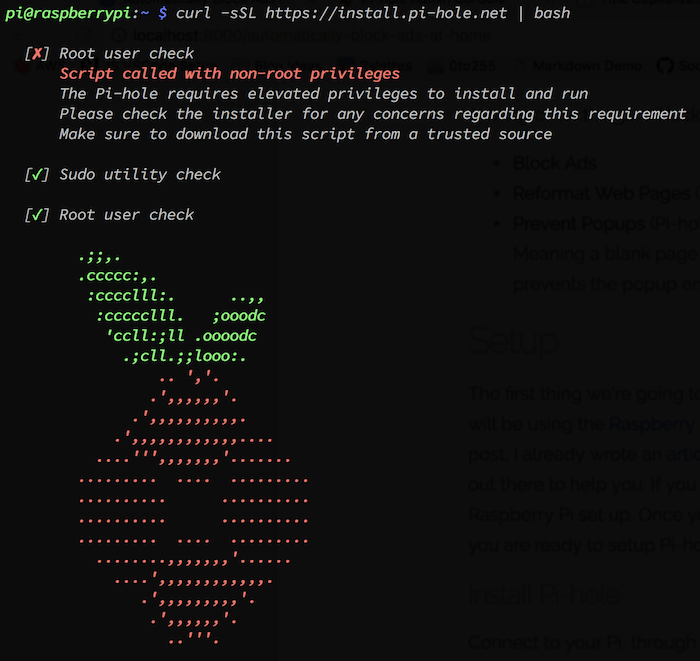
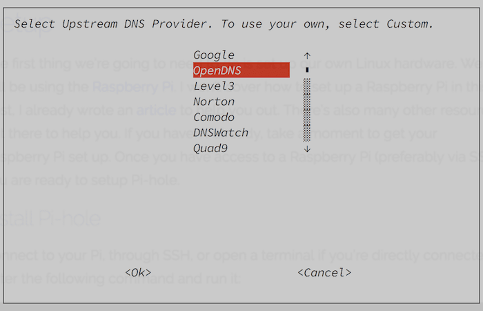
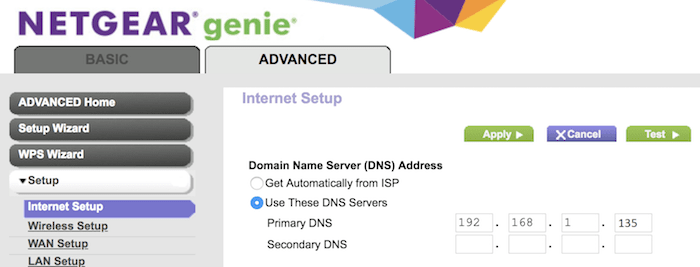
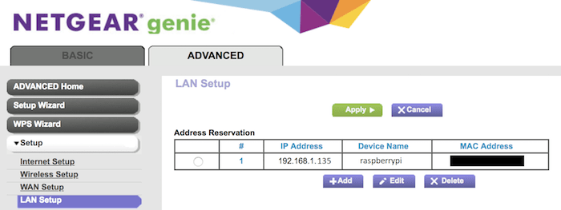
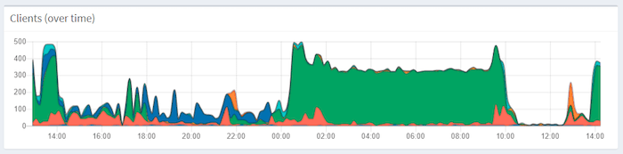

[//]: # 'Image of Pi-hole Dashboard'

Everybody hates ads. We see them everywhere. Our websites, apps, gaming consoles, smart TVs, the list goes on. Why can't we just use our devices ad-free? Well, for about $40, we can completely and automatically block ads across all of our devices at home.

We're going to accomplish this by using a program called [Pi-hole](https://pi-hole.net/). From the website, Pi-hole provides "Network-wide ad blocking via your own Linux hardware". We will be using a Raspberry Pi and Pi-hole to automaticaly block ads across all of our devices at home.

Over the next few sections, I'm going to show you why you need this in your life. Feel free to skip them if you want to get straight to the [setup](#setup).

---

<!-- TOC -->

- [Why Block Ads on Your Home Network?](#why-block-ads-on-your-home-network)
  - [Better Experience on All Devices](#better-experience-on-all-devices)
  - [Faster Load Times](#faster-load-times)
  - [Possibility to Save Money on Internet Usage](#possibility-to-save-money-on-internet-usage)
- [Side Note - Not All Ads will Be Blocked](#side-note---not-all-ads-will-be-blocked)
- [Setup](#setup)
  - [Install Pi-hole](#install-pi-hole)
- [Configuring Pi-hole](#configuring-pi-hole)
  - [Basic Configuration](#basic-configuration)
  - [IP Address Reservation (Optional)](#ip-address-reservation-optional)
  - [Advanced Client Logging (Optional)](#advanced-client-logging-optional)
- [Verify It Works](#verify-it-works)

<!-- /TOC -->

---

# Why Block Ads on Your Home Network?

The reason for blocking ads should be fairly obvious, but I'm going to cover some reasons that you may not have thought of:

- **Better Experience on All Devices**
- **Faster Load Times**
- **Possibility to Save Money on Internet Usage**

## Better Experience on All Devices

Pi-hole works by blocking ads on the network level. This means that there are no individual ad blockers on my devices. They all just get ad blocking automatically. When our device makes a network request, Pi-hole will block that request if it's for an ad.

I don't think we realize just how many ads are being forced on us when using our devices. As an example, below is a screenshot from my phone with and without Pi-hole. I look at my weather app every morning when I wake up. It's nice to not have to look at ads when I'm just trying to figure out what the weather is going to be like. The ads are gone, there is a weird blank spot in the UI now, but I can deal with that.

There is no individual device setup required for this to work on your devices! This ad blocking simply just works, everywhere, on all devices as long as they are connected to your network.


## Faster Load Times

Ok, duh! Having no ads means our pages will load faster. But just how much faster can we get?

If you're like me, you know the pain of having too many tabs opened in Chrome. A page that loads ads is a page that takes from my precious Chrome resources. How much time and how many resources are we really wasting on ads? Let's take a look at an example on [forbes.com](https://www.forbes.com/sites/forbespr/2018/07/18/forbes-releases-2018-list-of-the-worlds-most-valuable-sports-teams).

Forbes Article Without Ads Being Blocked:

<video-gif loop-duration="3000">
  <video width="688" height="372" controls muted>
    <source src="forbes-load-without-pi-hole.mp4" type="video/mp4">
    Video of forbes page load time without Pi-hole.
  </video>
</video-gif>

Let's analyze the above page load:

- At time **t = 0.388 sec**, content is ready to read
- At time **t = 1.639 sec**, a video ad had started to load
- At time **t = 6.291 sec**, an ad has loaded on the side bar
- At time **t = 14.222 sec**, an ad has loaded on the top bar

After **0.338 sec**, we are ready to read the content. Becuase of the ads, our browser is still using resources **14 seconds** after we're ready to start reading! Forbes is actually a pretty well-made site when it comes to browser performance. Imagine how many resources are being wasted by some of the other (slower) sites we use. Oh and by the way, this is over WiFi. It's much, much worse when using mobile data on our cell phones.

The Same Forbes Article with Ads Being Blocked:

<video-gif loop-duration="3000">
  <video width="708" height="362" controls muted>
    <source src="forbes-load-with-pi-hole.mp4" type="video/mp4">
    Video of forbes page load time with Pi-hole.
  </video>
</video-gif>

Let’s analyze the above page load:

- At time **t = 0.388 sec**, content is ready to read

Not bad! Now, let's take a look at one more reason why we want an ad blocker for our home network.

## Possibility to Save Money on Internet Usage

The main image of this post is of my Pi-hole dashboard that shows that in a 24 hour period, my home network had **10,678** queries. This means that **41%** of all queries were recognized as ads and thus blocked. This doesn't mean that 41% of my internet usage went to ads, but it does mean that there were a lot of network requests specifically for ads.

Like most, my ISP has a 1TB data cap limit per month. If I go over, I have to pay extra for each GB over. Removing ads frees up more data for me to use on things that really matter, like Netflix, Twitch, and YouTube. If I end up going over my cap (my fianc&#233;e and I consume a lot of data), I would literally be paying my ISP for websites to send me ads!

# Side Note - Not All Ads will Be Blocked

While Pi-hole is a great piece of software, it does not have a 100% block rate. This means that you may still see some ads, but at a drastically lowered amount. On your PC, I recommend using the [uBlock Origin](https://chrome.google.com/webstore/detail/ublock-origin/cjpalhdlnbpafiamejdnhcphjbkeiagm) Chrome Extension.

Among other things, uBlock Origin can do the following:

- **Block Ads**
- **Reformat Web Pages** (To look nicer when the ads are removed)
- **Prevent Popups** (Pi-hole will block the ad, but not the popup window. Meaning a blank page will still popup with just Pi-hole. uBlock Origin prevents the popup entirely.)

# Setup

Ok, let's get to work. The first thing we're going to need to do is set up our own Linux hardware. We will be using the [Raspberry Pi](https://www.raspberrypi.org/). I won't cover how to set up a Raspberry Pi in this post, I already wrote an [article](headless-raspberry-pi-setup) to help you out. There's also many other resources out there to help you. If you haven't already, take a moment to get your Raspberry Pi set up. Once you have access to a Raspberry Pi (preferably via SSH), you are ready to setup Pi-hole.

## Install Pi-hole

Connect to the Pi, through SSH, or open a terminal if you're directly connected. Enter the following command and run it:

```bash
curl -sSL https://install.pi-hole.net | bash
```



The installer will begin to run the setup. An install UI will pop up. Press enter to begin the installation. We will be using the defaults for pretty much everything. You will be able to reconfigure everything later if you mess something up, so don't worry too much.

On the "Choose an Interface" screen, select "eth0". **Note:** If your Raspberry Pi is connected over WiFi only, then select "wlan0". With your network interface selected, press enter to continue. On the "Select Protocols" screen, select "Ok" to select both IPv4 and IPv6 protocols.

Select "Yes" to log queries as well as "Yes" to installing the admin interface. These tools will allow us to see graphs and metrics about our network usage.

Here's the only default I don't use. On the "Select Upstream DNS Provider" screen, I select "OpenDNS". Use the arrow keys to move down and highlight "OpenDNS", then press enter.



Once you are finished with the install, you can type `exit` to quit the SSH / terminal session. That's it, Pi-hole is now installed!

Let's verify that the installation worked. Open your browser and navigate to the IP address of the Pi followed by "/admin". So, if my Pi had an IP address of "192.168.1.135", then I would navigate to:

```
http://192.168.1.135/admin
```

If everything worked, you should see the Pi-hole dashboard, which should look similar to the image at the top of this post.

# Configuring Pi-hole

With Pi-hole installed, it's now time to configure it to be used across our entire network.

## Basic Configuration

To set up Pi-hole on our network, we need to tell our router to use the Raspberry Pi as its DNS. We need to make sure we have the IP address of our Raspberry Pi written down. For these examples, I will be using the IP address "192.168.1.135".

It's time to log into your router. Most likely this can be done by going to "192.168.1.1" in your browser and logging in with your credentials. A quick Google search should help you if you're having trouble.

Navigate to the DNS section/settings in your router's web portal. For me, I had to go to Advanced -> Internet Setup, and found it under a section called "Domain Name Server (DNS) Address". Enter the IP address of the Pi. For my router, I did this by selecting "Use These DNS Servers", and then entering in my Pi's IP address into the "Primary DNS" field.



Make sure that there are no other DNS entries ("Secondary DNS"). If there are, make sure that they are left blank. Apply and save your new changes. Your router may restart now to apply the changes. **Note:** If you do not have internet after the router reboots, go back to the DNS settings in the web portal and reset them. I did this by selecting "Get Dynamically from ISP".

## IP Address Reservation (Optional)

While not required, I do recommend reserving the Pi's IP address. Because we've hard-coded the IP address of the PI to the router's DNS, we don't want to run into an issue where the router grants a different device the IP address of the Pi.

Let's reserve the IP address to only be used for the Pi. In my router's web portal, I went to Advanced -> Lan Setup -> Address Reservation. Then I clicked "Add" and selected my Pi from the list of devices. Yours should be named "raspberrypi". After that I clicked apply and closed my browser.



## Advanced Client Logging (Optional)

Pi-hole comes with some advanced network statistics at the client level. This allows you to see every request from every device. It lets you know which devices are getting the most ads. This is an advanced feature and can only be enabled if your router has support for custom DNSMasq.



Unfortunately, most routers do not support custom DNSMasq options. If your router has advanced firmware, such as DD-WRT, then you are good to go! Search online to see if your router supports custom DNSMasq.

If your router is compatible, go [here](https://discourse.pi-hole.net/t/how-do-i-configure-my-devices-to-use-pi-hole-as-their-dns-server/245) to learn how to set up advanced client logging. **Be sure to use method #2.**

If you are curious about upgrading your router's firmware to DD-WRT, search online to find a tutorial. Be warned though, that this can be dangerous and mess with your router. I don't recommend it unless you absolutely know what you are doing. I was able to find a [tutorial](https://www.tweaking4all.com/hardware/netgear-r7000-dd-wrt/) for my router and upgraded it without issues.

# Verify It Works

That's it, everything should be set up and ready to go now! To test that Pi-hole is working, you can use [this page](https://pi-hole.net/pages-to-test-ad-blocking-performance/) to verify that ads are being blocked. Check out your Pi-hole dashboard at [http://pi.hole/admin/](http://pi.hole/admin/). There's a lot of cool metrics and configurations to explore. If you lost your Pi-hole admin password, go [here](https://discourse.pi-hole.net/t/how-do-i-set-or-reset-the-web-interface-password/1328) to learn how to reset it. Now go and enjoy the world, ad free!

In a future post I will be exploring the feasability of blocking all ads when outside the home on a mobile network. See you then!
